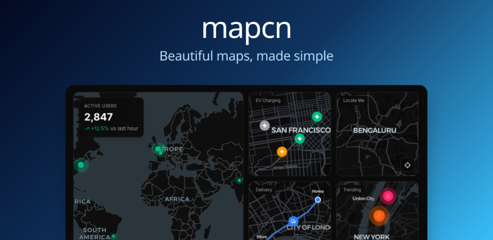

# mapcn

<div align="center">


**Beautiful map components. 100% Free, Zero config, one command setup.**

Free & open-source, ready-to-use, customizable map components for React.  
Built on [MapLibre GL](https://maplibre.org/), styled with [Tailwind CSS](https://tailwindcss.com/), works seamlessly with [shadcn/ui](https://ui.shadcn.com/).

[**Get Started**](https://mapcn.dev/docs) • [**Installation**](https://mapcn.dev/docs/installation) • [**Components**](https://mapcn.dev/docs/basic-map)



<a href="https://vercel.com/oss">
  
</a>

</div>

## Features

- 🎨 **Theme-aware** — Automatically adapts to light/dark mode
- 🎯 **Zero config** — Works out of the box with sensible defaults
- 📦 **shadcn/ui compatible** — Uses the same patterns and conventions
- 🚀 **One command setup** — Get started instantly with minimal configuration
- ⚡ **TypeScript first** — Full type safety and excellent developer experience
- 🎛️ **Fully customizable** — Tailwind CSS styling with component variants
- 🗺️ **MapLibre powered** — Built on the robust MapLibre GL mapping library

## Installation

Install mapcn components using the CLI:

```bash
npx mapcn-ui@latest add [component-name]
```

Or install the base dependencies:

```bash
npm install maplibre-gl
npm install -D tailwindcss
```

## Quick Start

1. **Initialize your project** with the required configuration:
   ```bash
   npx mapcn-ui@latest init
   ```

2. **Add a map component**:
   ```bash
   npx mapcn-ui@latest add map
   ```

3. **Use in your React app**:
   ```tsx
   import { Map } from "@/components/ui/map"
   
   export default function App() {
     return (
       <Map 
         initialViewState={{
           longitude: -100,
           latitude: 40,
           zoom: 3.5
         }}
         style={{ width: '100%', height: '400px' }}
       />
     )
   }
   ```

## Usage Examples

### Basic Map
```tsx
import { Map } from "@/components/ui/map"

<Map
  initialViewState={{
    longitude: -122.4,
    latitude: 37.8,
    zoom: 14
  }}
  mapStyle="https://demotiles.maplibre.org/style.json"
/>
```

### Themed Map
```tsx
// Automatically adapts to your app's light/dark theme
<Map theme="auto" />
```

## Project Structure

```
mapcn/
├── components.json          # Component configuration
├── public/
│   ├── banner.png          # Project banner
│   ├── icon.svg           # Project icon
│   └── r/                 # Registry files
│       ├── map.json       # Map component registry
│       └── registry.json  # Component registry
├── package.json           # Dependencies and scripts
└── next.config.ts        # Next.js configuration
```

## Development

This project is built with:

- **TypeScript** for type safety
- **Next.js** for the documentation site
- **Tailwind CSS** for styling
- **MapLibre GL** for map rendering
- **ESLint** for code linting

To contribute or run locally:

1. Clone the repository
2. Install dependencies: `npm install`
3. Start development server: `npm run dev`

## Contributing

We welcome contributions! Please feel free to submit a Pull Request. For major changes, please open an issue first to discuss what you would like to change.

## License

This project is licensed under the MIT License. See the [LICENSE](LICENSE) file for details.

## Support

- 📖 [Documentation](https://mapcn.dev/docs)
- 🐛 [Issue Tracker](https://github.com/AnmolSaini16/mapcn/issues)
- 💬 [Discussions](https://github.com/AnmolSaini16/mapcn/discussions)

---
*Documentation improved by [Codec8](https://codec8.com) — AI-powered docs for GitHub repos. [Generate docs for your repo →](https://codec8.com)*